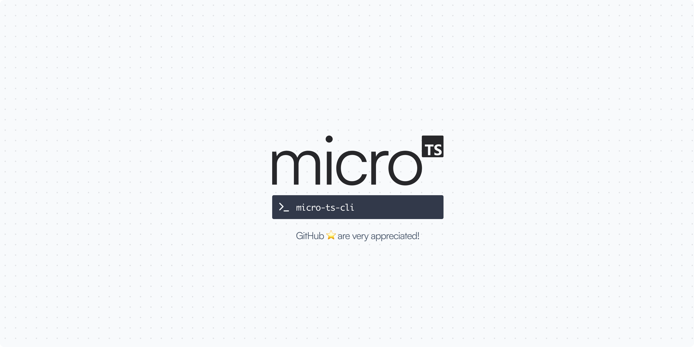

<p align="center" >
    
</p>
<br />
<p align="center" style="max-width:50%;margin:0 auto;">
  <code>micro-ts-cli</code> A command-line interface for quickly bootstrapping TypeScript projects with microbundle
</p>
<br />

<a href="https://github.com/adevinwild/micro-ts/generate">
  <p align="center">
    <kbd>Generate a new repository ✨</kbd>
  </p>
</a>

## Features 🎉

-   🚀 Quickly create a new TypeScript project with microbundle
-   🎨 Easy project customization with interactive prompts
-   📥 Automatically clone and setup the micro-ts template repository

## Usage 📖

To use `micro-ts-cli`, simply run the following command:

```bash
npm install -g micro-ts-cli
```

And you can use it like this:

```bash
npx micro-ts-cli
```

This will launch the interactive prompts to create a new TypeScript project with microbundle.

## How micro-ts works 🤔

[micro-ts](https://github.com/adevinwild/micro-ts) is a template repository on GitHub designed to quickly bootstrap TypeScript projects with microbundle.
`micro-ts-cli` clone the micro-ts repository and sets up the new project by customizing the values in the package.json file.

For more information on micro-ts and its features, please visit the repository at: [https://github.com/adevinwild/micro-ts](https://github.com/adevinwild/micro-ts)

## License 📝

[MIT](./LICENSE)

<a href="https://github.com/adevinwild/micro-ts/generate">
  <p align="center">
    <kbd>Generate a new repository ✨</kbd>
  </p>
</a>
